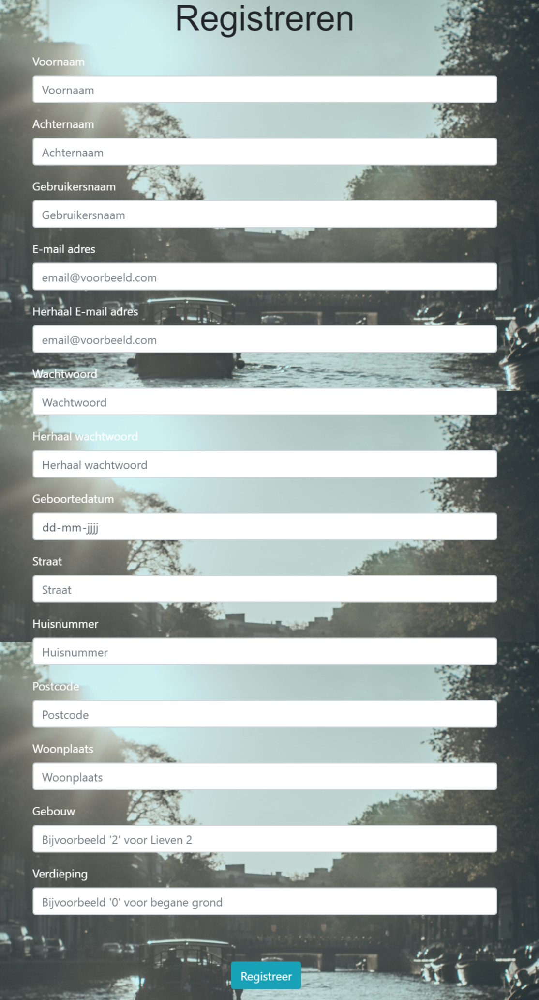
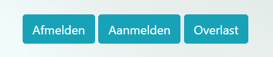
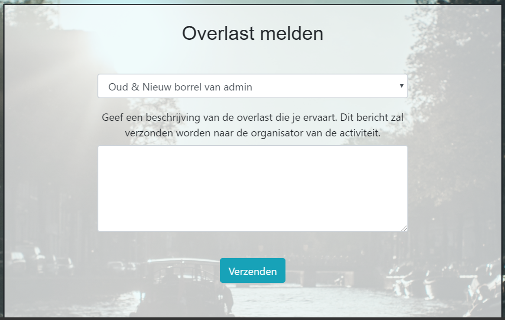
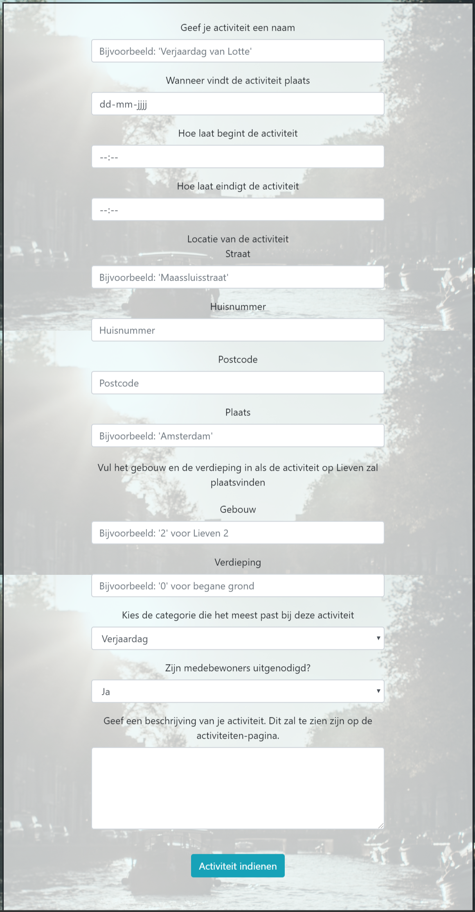
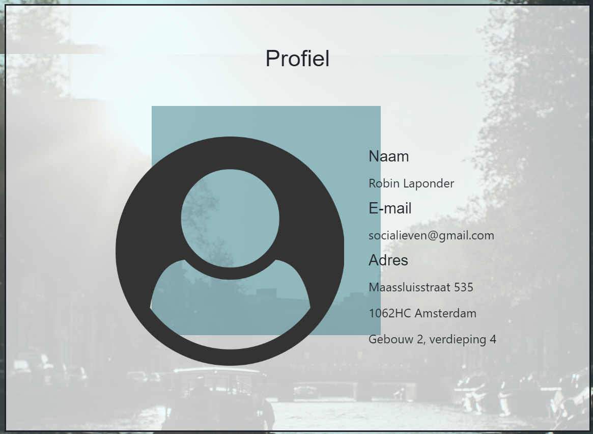

# Final Project - technical overview

### Index 
*Dit is de eerste pagina die een gebruiker te zien krijgt en fungeert als homepage.* 

url: /'' 
functie: socialieven.views.index 
bestanden: index.html 
functionaliteit: 
* **Inloggen** 

    

### Registreren 
*Op deze pagina ziet de gebruiker een formulier dat hij/zij moet invullen om zich te registreren.* 
url: /register 
functie: users.views.register 
bestanden: register.html 
functionaliteit: 
* **Registreren van een gebruiker** 

    

### Uitloggen 
*Wanneer een gebruiker is ingelogd, kan hij/zij via de navbar uitloggen.* 
url: /logout 
functie: users.views.logout_view 
bestanden: -
functionaliteit: 
* **Uitloggen van een gebruiker** 

### Activiteiten 
*Deze pagina geeft een overzicht van alle activiteiten die zijn gecreëerd door alle gebruikers.* 

url: /activiteiten 
functie: socialieven.views.activiteiten 
bestanden: activiteiten.html 
functionaliteit: 
* **Activiteiten weergeven** 

    

* **Aanmelden** 
*Een gebruiker kan zich voor een activiteit aanmelden, door op de 'aanmelden'-knop te klikken.* 
url: /aanmelden/id 
functie: socialieven.views.aanmelden 
bestanden: - 
* **Afmelden** 
*Wanneer een gebruiker is aangemeld voor een activiteit, kan hij/zich zich afmelden door op de 'afmelden'-knop te klikken.* 
url: /afmelden/id 
functie: socialieven.views.afmelden 
bestanden: - 
* **Overlast** 
*Een gebruiker kan op de 'overlast'-knop klikken, om overlast te melden van een activiteit. De gebruiker komt op een pagina waarop een formulier ingevuld moet worden, dat vervolgens per mail verzonden wordt aan de organisator van de betreffende activiteit.* 
url: /overlast/id 
functie: socialieven.views.overlast 
bestanden: overlast.html 
functionaliteit: 
* **Overlast melden** 

    

### Nieuwe activiteit 
*Door middel van een formulier, kan een gebruiker een activiteit creëren, die vervolgens wordt weergegeven op de 'activiteiten'-pagina.*

url: /nieuwe_activiteit 
functie: socialieven.views.nieuwe_activiteit 
bestanden: nieuwe_activiteit.html 
* **Nieuwe activiteit creëren** 

    

### Profiel 
*Op deze pagina ziet een gebruiker zijn/haar persoonlijke informatie.* 

url: /profiel 
functie: users.views.profiel 
bestanden: profiel.html 
functionaliteit: 
* **Persoonlijke informatie bekijken** 

    

### Mijn activiteiten 
*Deze pagina laat zien welke activiteiten gecreëerd zijn door de gebruiker.* 

url: /mijn_activiteiten 
functie: socialieven.views.mijn_activiteiten 
bestanden: mijn_activiteiten.html 
functionaliteit: 
* **Door gebruiker gemaakte activiteiten weergeven** 

### Mijn aanmeldingen 
*Hier ziet een gebruiker voor welke activiteiten hij/zij zichzelf heeft aangemeld. Voor eigen activiteiten wordt de gebruiker automatisch aangemeld en ook deze activiteiten zijn te zien op deze pagina.* 

url: /mijn_aanmeldingen 
functie: socialieven.views.mijn_aanmeldingen 
bestanden: mijn_aanmeldingen.html 
functionaliteit: 
* **Weergeven van activiteiten waar gebruiker voor aangemeld is** 